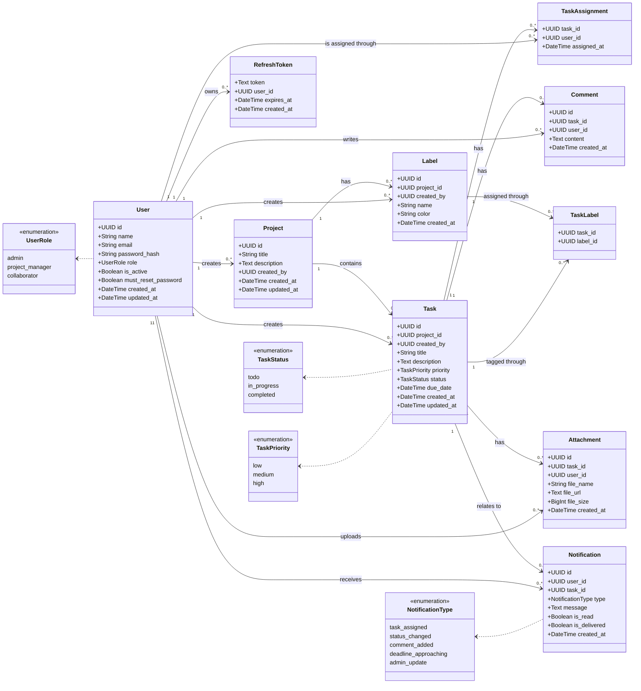

# Class Diagram

The diagram below translates the ER diagram into UML-style classes. Database
tables are represented as classes, while join tables are represented as
association classes.

```mermaid
classDiagram
direction LR

class User {
  +UUID id
  +String name
  +String email
  +String password_hash
  +UserRole role
  +Boolean is_active
  +Boolean must_reset_password
  +DateTime created_at
  +DateTime updated_at
}

class Project {
  +UUID id
  +String title
  +Text description
  +UUID created_by
  +DateTime created_at
  +DateTime updated_at
}

class Task {
  +UUID id
  +UUID project_id
  +UUID created_by
  +String title
  +Text description
  +TaskPriority priority
  +TaskStatus status
  +DateTime due_date
  +DateTime created_at
  +DateTime updated_at
}

class TaskAssignment {
  +UUID task_id
  +UUID user_id
  +DateTime assigned_at
}

class Comment {
  +UUID id
  +UUID task_id
  +UUID user_id
  +Text content
  +DateTime created_at
}

class Attachment {
  +UUID id
  +UUID task_id
  +UUID user_id
  +String file_name
  +Text file_url
  +BigInt file_size
  +DateTime created_at
}

class Notification {
  +UUID id
  +UUID user_id
  +UUID task_id
  +NotificationType type
  +Text message
  +Boolean is_read
  +Boolean is_delivered
  +DateTime created_at
}

class Label {
  +UUID id
  +UUID project_id
  +UUID created_by
  +String name
  +String color
  +DateTime created_at
}

class TaskLabel {
  +UUID task_id
  +UUID label_id
}

class RefreshToken {
  +Text token
  +UUID user_id
  +DateTime expires_at
  +DateTime created_at
}

class UserRole {
  <<enumeration>>
  admin
  project_manager
  collaborator
}

class TaskPriority {
  <<enumeration>>
  low
  medium
  high
}

class TaskStatus {
  <<enumeration>>
  todo
  in_progress
  completed
}

class NotificationType {
  <<enumeration>>
  task_assigned
  status_changed
  comment_added
  deadline_approaching
  admin_update
}

UserRole <.. User
TaskPriority <.. Task
TaskStatus <.. Task
NotificationType <.. Notification

User "1" --> "0..*" Project : creates
User "1" --> "0..*" Task : creates
User "1" --> "0..*" TaskAssignment : is assigned through
User "1" --> "0..*" Comment : writes
User "1" --> "0..*" Attachment : uploads
User "1" --> "0..*" Notification : receives
User "1" --> "0..*" Label : creates
User "1" --> "0..*" RefreshToken : owns

Project "1" --> "0..*" Task : contains
Project "1" --> "0..*" Label : has

Task "1" --> "0..*" TaskAssignment : has
Task "1" --> "0..*" Comment : has
Task "1" --> "0..*" Attachment : has
Task "1" --> "0..*" Notification : relates to
Task "1" --> "0..*" TaskLabel : tagged through

Label "1" --> "0..*" TaskLabel : assigned through
```
